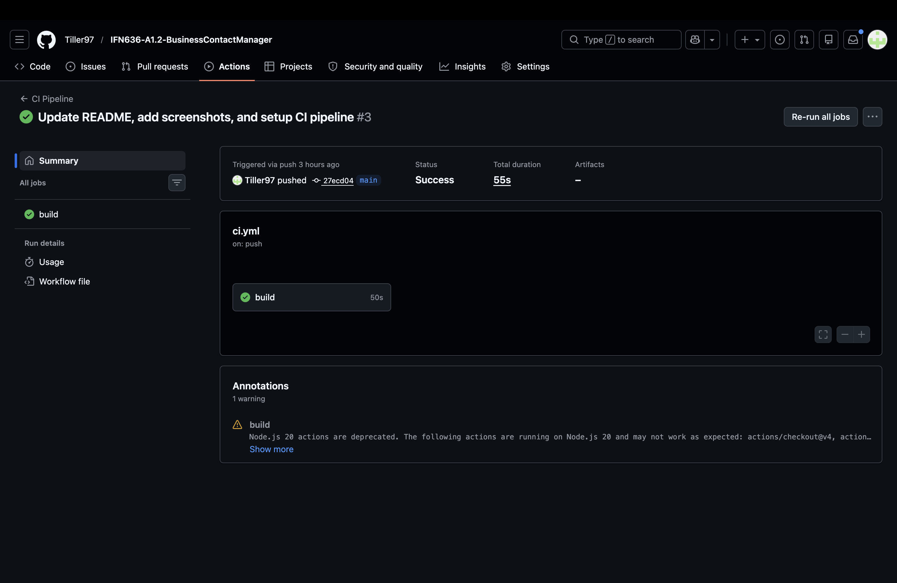
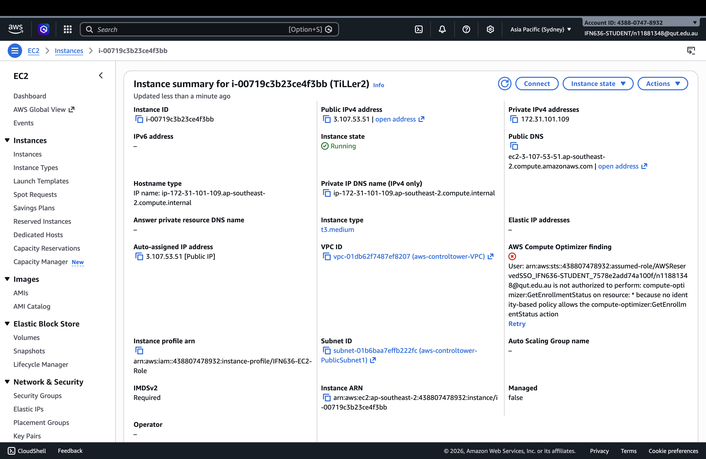
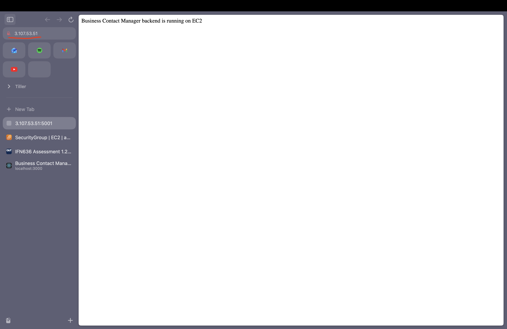
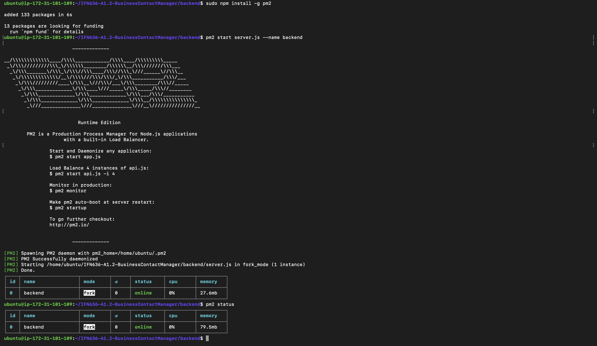
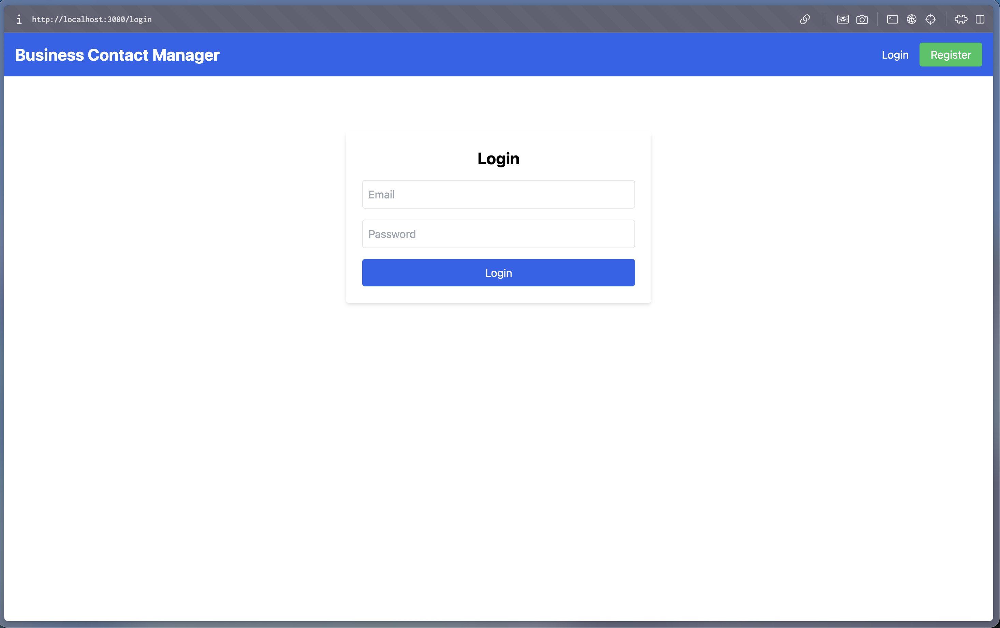
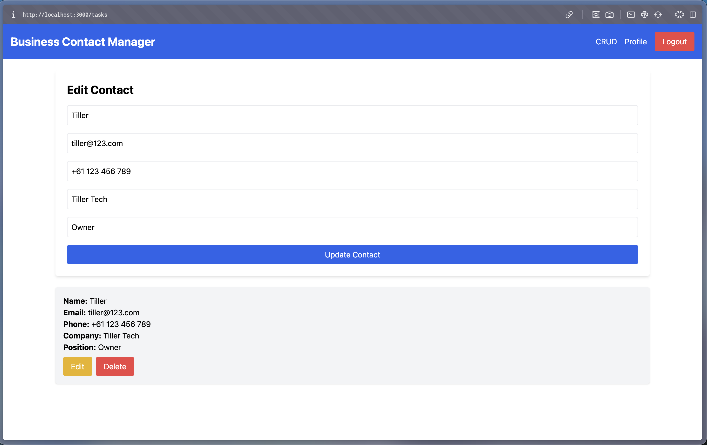
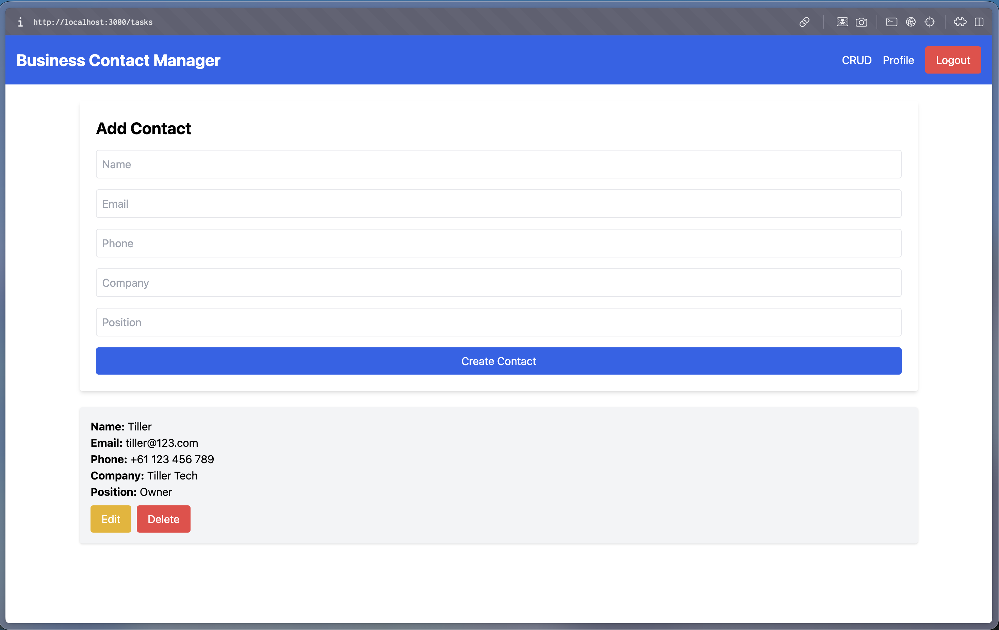
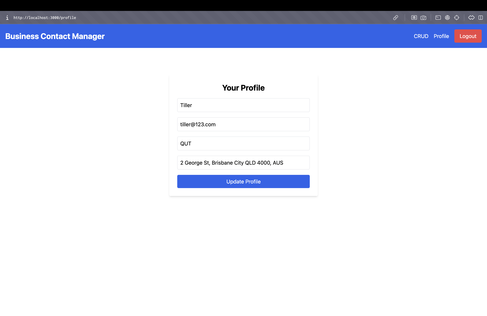

# Business Contact Manager

## Test Account

Email: tiller@123.com  
Password: 123456

## Project Overview

This project is a full-stack Business Contact Manager web application developed for IFN636 A1.2. It enables authenticated users to manage business contacts through a secure and user-friendly interface.

The system supports core CRUD operations and integrates frontend and backend components with a MongoDB database.

This application demonstrates full-stack development with authentication, database integration, CI/CD pipeline, and cloud deployment using AWS EC2.

---

## Features

* User registration and login with secure authentication  
* JWT-based authentication and protected routes  
* Create, view, update, and delete business contacts  
* Persistent data storage using MongoDB  
* RESTful API integration  

---

## System Highlights

* Full-stack architecture (React + Node.js + MongoDB)
* Secure authentication using JWT
* CI/CD pipeline with GitHub Actions
* Cloud deployment using AWS EC2 and PM2

---

## Technologies Used

### Frontend

* React  
* Axios  
* Bootstrap  

### Backend

* Node.js  
* Express.js  
* MongoDB Atlas  
* Mongoose  
* JWT  
* bcryptjs  

---

## CI/CD Pipeline

GitHub Actions is used to implement Continuous Integration.

This ensures code quality and validates application functionality automatically before deployment.

* Triggered on push & pull request  
* Installs dependencies
* Builds frontend application
* Runs backend tests (Mocha)

### CI Result

The pipeline runs successfully after each commit.



---

## Deployment (AWS EC2)

The backend is deployed on an AWS EC2 instance and managed using PM2 as a process manager.

PM2 is used to keep the application running continuously and handle process management in production.

The application demonstrates basic DevOps practices including process management and cloud hosting.

### EC2 Instance



### Public Access

The backend API is deployed on an AWS EC2 instance and can be accessed via the following public URL:

http://52.64.102.8:5001

Note: The application was deployed and tested successfully on AWS EC2. In the lab environment, public IP addresses are dynamically assigned and may change after instance restart.




### PM2 Process Status

The application is running in fork mode and remains online.



---

## Application Screenshots

### 🔐 Login Page

User authentication interface for secure login.



---

### 📇 Contact List

Display all saved business contacts.



---

### ✏️ Edit Contact

Users can update existing contact information.



---

### 👤 Profile Page

User profile management interface.



---

## Installation

Follow the steps below to run the project locally:

### 1. Clone repository

```bash
git clone https://github.com/Tiller97/IFN636-A1.2-BusinessContactManager.git
cd IFN636-A1.2-BusinessContactManager
```

### 2. Install dependencies

#### Backend

```bash
cd backend
npm install
```

#### Frontend

```bash
cd ../frontend
npm install
```

---

### 3. Environment variables

Create `.env` inside backend:

```env
MONGO_URI=your_mongodb_connection_string
JWT_SECRET=your_jwt_secret
PORT=5001
```

---

### 4. Run project

#### Backend

```bash
cd backend
npm start
```

#### Frontend

```bash
cd frontend
npm start
```

---

### 5. Access the application:
   http://localhost:3000

---

## Project Structure

```
IFN636-A1.2-BusinessContactManager/
├── backend/
├── frontend/
├── screenshots/
├── .github/workflows/ci.yml
└── README.md
```

---

## Author

TengYi Huang  
Master of Information Technology (Artificial Intelligence)  
Queensland University of Technology
